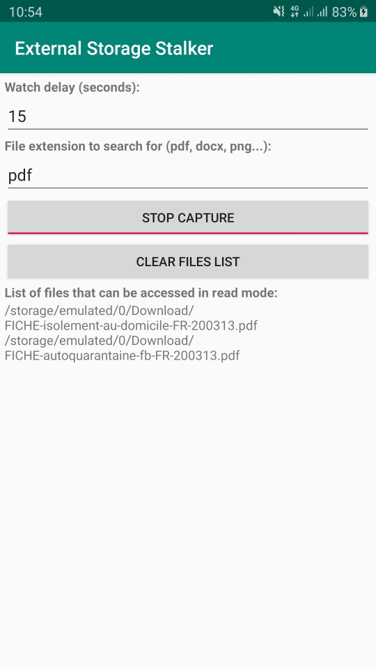

# External Storage Stalker

Android v6+ application to monitor (stalk) all the external storage locations referenced into the system and list the files that can be accessed in read mode.

The application is developed using Android Studio so you can import the project into it in order to compile a APK bundle or use the command line provided.

# Motivation

Show during a mobile application assessment, in a explicit way to non-technical people, that any content stored in a external storage location can be accessed by any application having at least the `android.permission.READ_EXTERNAL_STORAGE` permission 
and, thus, any sensitive data stored on these locations is exposed to unexpected access.

Application like this exists on the Play store but I want to be sure that the content captured was not send anywhere and I have not found an Open source application published on the stored so I have decided to create and share a simple one.

# Build command line

Use the following command line to build a APK in debug mode `gradlew clean cleanBuildCache assembleDebug`

# Overview

